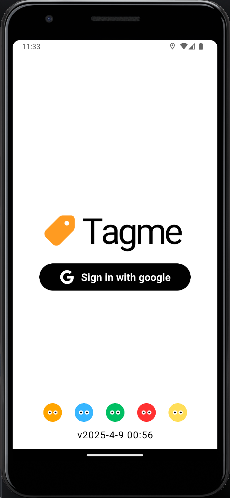
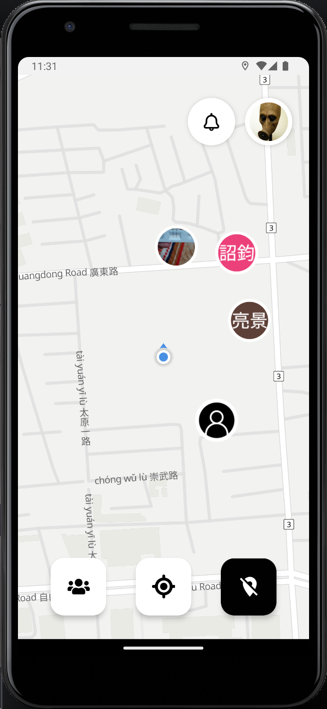
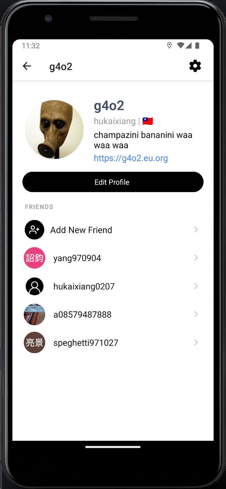

# Tagme - 好友即時定位



## Setup

### app

```
npm install
npm run prebuild
npm run android
```

### database
(需要 Docker)

```
supabase start
```

## 主要功能

- 使用者註冊／登入 (Google 登入)
- 好友即時定位、隱形模式
- 個人檔案 (頭貼、自介、國家等)
- 加好友、好友申請通知

## 使用語言與框架

### 前端

- react native
- expo

### 後端

- supabase
- supabase edge functions

## Screenshots

> 📎 開發畫面、supabase資料庫 <br/>

   
> 📎 個人檔案、編輯個人檔案畫面 <br/>


> 📎 地圖、設定 <br/>

    
> 📎 加好友、好友申請通知、好友欄 <br/>

    
